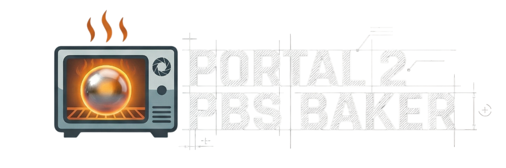

<div align="center">

<h2>A custom map pre-processor and light baker for Source Engine</h2>
</div>

This tool is designed to bridge the gap between legacy Source Engine lighting (BSP/VRAD) and modern Physically Based Shading (PBS). It parses Valve Map Files (`.vmf`), extracts lighting data, converts legacy attenuation math into physical units, and bakes "Light Clusters" into high-precision LUT textures.

> [!WARNING]  
> **This software is for EDUCATIONAL PURPOSES ONLY.**
> 
> This tool *does not work out-of-the-box* with Portal 2 or any Source game. It is a specific component of a custom rendering pipeline and generates data structures required by a specific set of **custom HLSL PBR shaders**. Without these shaders, the generated data is useless.

## 🛠️ How It Works

The tool performs a complex "Baking" process that runs before the standard VBSP/VRAD compilation:
1.  Entity Parsing.
2.  Physics Unification: Converts legacy Source attenuation and Area Light dimensions into a unified PBR formula.
3.  Raytraced Clustering.
4.  Asset Generation: LUTs, Materials, VScript.
5.  VMF Patching.

## 🚀 Usage

```bash
# Draft Run (Analyze lights, check scoring, do not modify files)
cargo run -- --input map_name.vmf --draft-run --dump-clusters

# Asset Update (Generate Textures/Scripts, do NOT touch VMF)
# Useful for hot-reloading in-game
cargo run -- --input map_name.vmf

# Final Build (Prepare VMF for VBSP compilation)
cargo run -- --input map_name.vmf --final
```

## ⚖️ License & Rights

**All rights reserved.**

This source code is provided for viewing, running, and educational analysis only. You are not granted any rights to use, copy, modify, merge, publish, distribute, sublicense, and/or sell copies of the Software.
