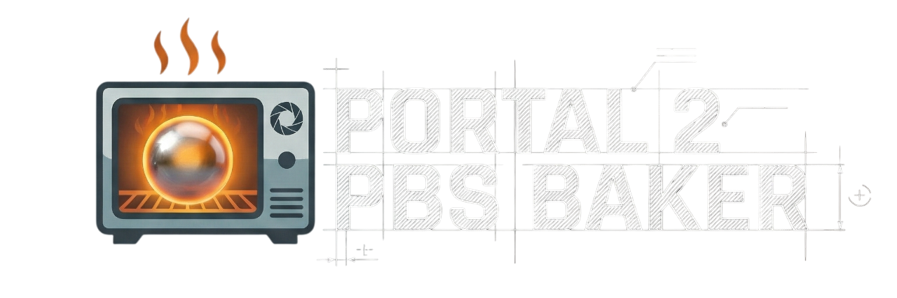
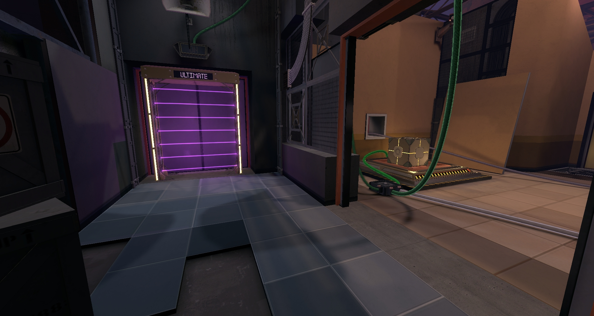
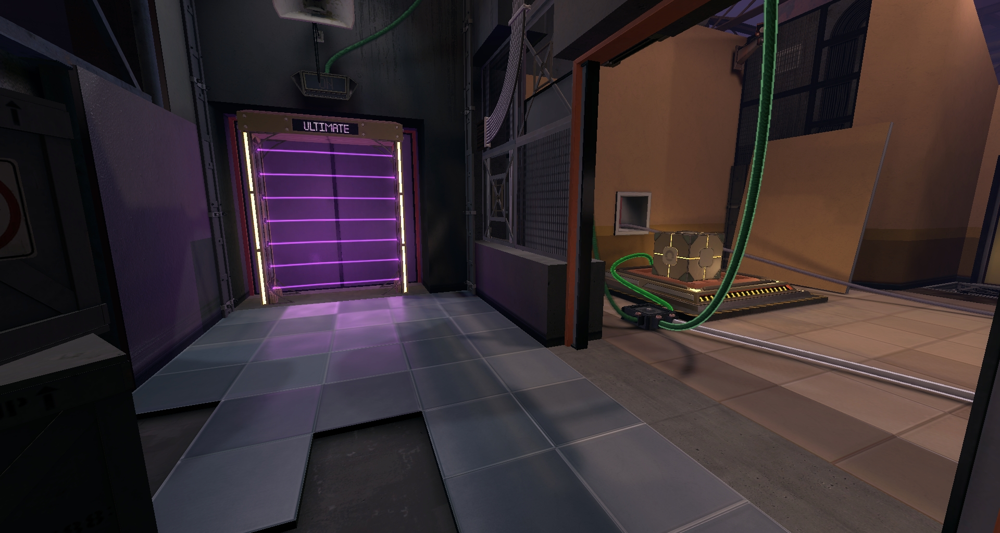
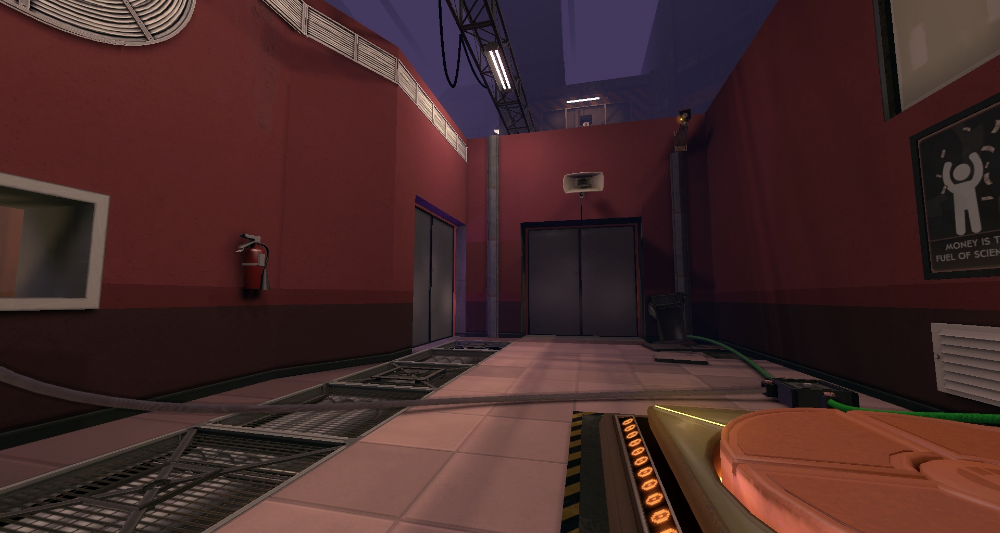
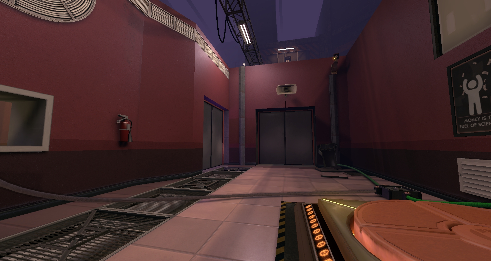
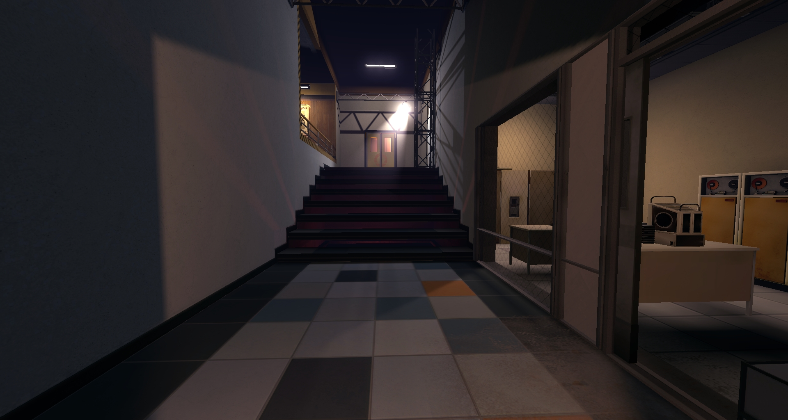
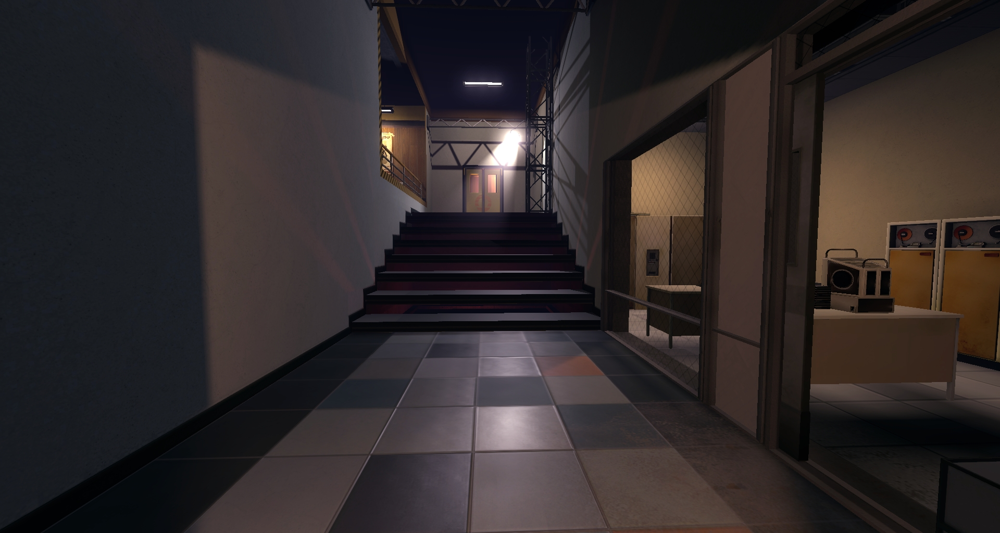

<div align="center">

<h2>A custom map pre-processor and light baker for Source Engine</h2>
</div>

This tool is designed to bridge the gap between legacy Source Engine lighting (BSP/VRAD) and modern Physically Based Shading (PBS/PBR). It parses Valve Map Files (`.vmf`), extracts lighting data, converts legacy attenuation math into physical units, and bakes "Light Clusters" into high-precision LUT textures.

> [!WARNING]
> **This software is for EDUCATIONAL PURPOSES ONLY.**
>
> This tool *does not work out-of-the-box* with Portal 2 or any Source game. It is a specific component of a custom rendering pipeline and generates data structures required by a specific set of **custom HLSL PBR shaders**. Without these shaders, the generated data is useless.

## 📺 Showcase

YT video here soon. I hope

| Vanilla | With PBS |
|:-----------------------:|:----------------:|
|  |  |
|  |  |
|  |  |

## 🛠️ How is this even possible in Vanilla Portal 2?

You might be wondering how I forced the 2011 Source Engine to output dynamic PBR without modifying the engine or using DLL hacks. 

It all works thanks to a forgotten debug shader buried in the game files called [`ScreenSpace_General`](https://github.com/ficool2/sdk_screenspace_shaders), which allows me to implement custom HLSL shader effects. However, there is a fundamental problem: this shader is completely "blind." It is entirely isolated from the game's logic, meaning it has no idea where the light sources are, and the engine won't share that data at runtime.

**This custom Rust compiler add-on solves that problem.** 

Acting as a pre-processor, it does the heavy lifting outside of the engine before the standard VBSP/VRAD compilation. It scans the map file, locates all geometry, and runs a complex mathematical analysis (Ray-Surface Intersection). Finally, it packs all the necessary lighting and reflection data into a texture at compile-time. By feeding this texture to the shader, we completely bypass the issue of missing data during runtime inside the game.

## ⚙️ How to use this

The compiler processes materials directly during the map compilation stage. You don't need to completely rewrite your map logic to get it working.

1. **Adding PBR to existing materials:** I use a custom syntax that allows you to easily inject PBR properties. You simply add an internal `PBR` block inside the existing standard shader definition (e.g., inside `LightmappedGeneric` or other).
```js
LightmappedGeneric
{
	"$BaseTexture" "pcapture/tile/pc_tile04"
	"$BumpMap" "pcapture/tile/pc_tile_ssbump"
	"$BaseTextureTransform" "center 0 0 scale 2 2 rotate 0 translate 0 0"
	"$SurfaceProp" "Tile"
	"$SSBump" "1"

	"$Detail" "detail/detail_concrete001a"
	"$DetailScale" "4.25"
	"$DetailBlendFactor" .3

	PBR 
	{
		$BumpMap "pcapture/tile/pc_tile_nmap"  
		$MraoTexture "pcapture/tile/pc_tile_mrao"

		$UseCubemap 1
		$ReflectionScale 0.1

		$MetalnessScale 0.2
		$RoughnessBias 0.5
		$AO_Scale 1.0
		$DielectricF0 0.04

		$NormalScale 1
		$UV_Scale 2

		$AlbedoTint "[0.978 1.0 0.96 1.77]"

		$FadeStart 1024
		$FadeEnd 2048
	}
}
```
2. **Custom FGD Entities:** Using a custom `base.fgd` file, I added "fake" entities to the map (such as `func_ggx_surface`). These entities do not exist in the vanilla game logic, but they allow mappers to flexibly fine-tune and apply PBR properties to any specific brush or surface on the map.

## 🆚 Why is this better than P2CE?

Wait, why go through all this suffering with the vanilla engine when *Portal 2: Community Edition* exists with PBR out of the box? 

* **Optimization:** P2CE is still in beta, suffers from swap buffering overload, and can lag even on powerful machines. Our method is highly optimized and will run smoothly even on a "potato" PC that can handle the original Portal 2 on high settings.
* **True Area Lights:** P2CE doesn't have true area lights yet. A long fluorescent tube there just gives a small, ugly round specular highlight. Our shader calculates honest specular reflections from rectangular light sources, making it look mathematically correct.
* **Energy Conservation & Realistic Highlights:** In P2CE, specular highlights often appear unnaturally dark, as if ~75% of the light's energy is lost. Our implementation correctly handles intensity, resulting in vivid, physically accurate reflections that truly "pop."
* **Per-Surface Overrides:** This is a game-changer. You can **override material parameters for a specific surface** without creating a new `.vmt` file. Want one specific wall to be shinier than the rest of the room? Just change it in the entity properties. You can also tweaking any lights entity.
* **Total Control & Stability:** We, CropFactor Team, creators of Project Capture mod, don't depend on someone else's code, and we don't wait months for upstream bug fixes. If something breaks, we fix it ourselves. We depend only on pure math, and the math produces incredibly beautiful results!


## ⚖️ License & Rights

Note: The custom HLSL shaders and a full open-source license for this project will be made available to the public immediately following the release of [Project Capture](https://www.moddb.com/mods/pcapture).
Currently, all rights are reserved. This source code is provided for viewing and educational analysis only. Use, modification, or distribution is not permitted at this stage.
